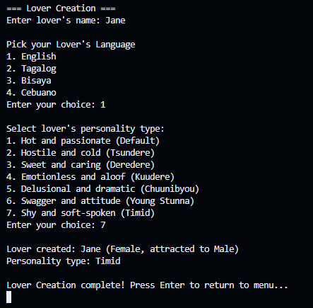
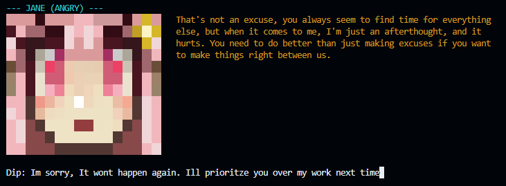
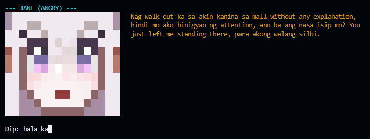
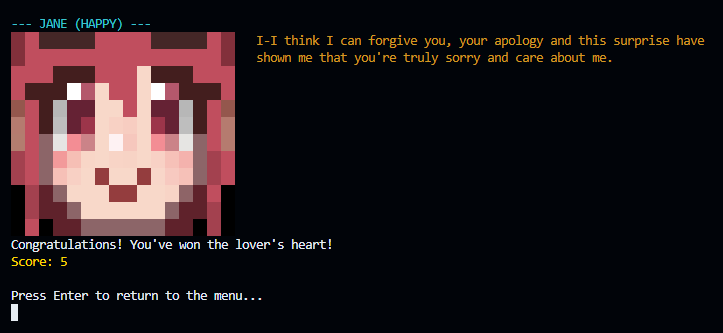
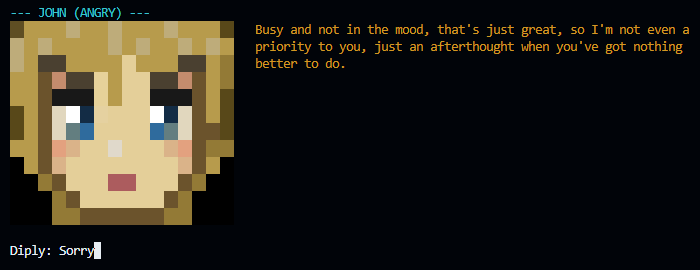
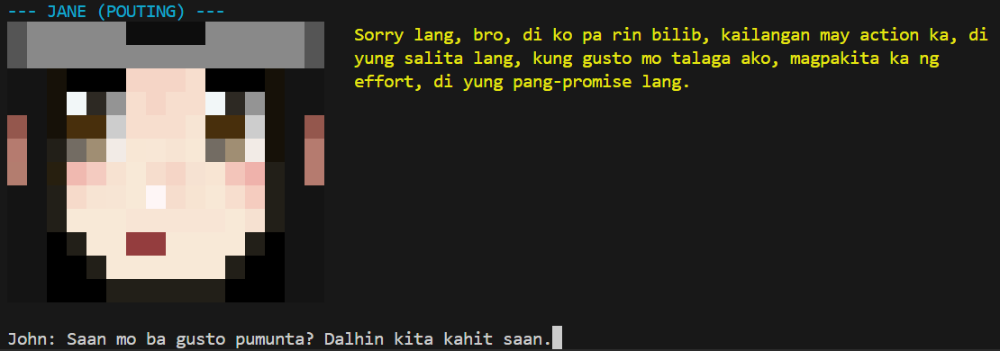
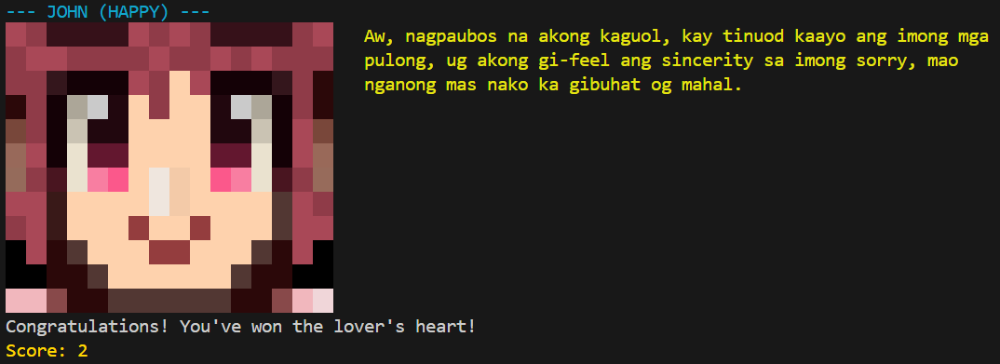
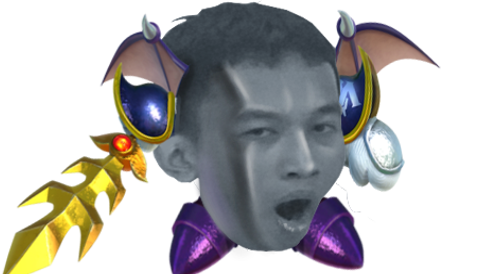
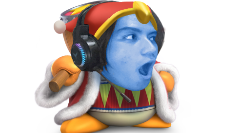

<div align="center">

# 🤖T.A.M.P.O. — The AI Mood-Patching Odyssey  
**T.A.M.P.O.** is a Java console game that simulates relationship “tampo” dynamics through conversations with different AI personalities. You create a profile, pick a lover personality, and try to earn forgiveness through "panunuyo". The AI replies in character and appends a tiny JSON object indicating its mood and whether it forgives you, which the game uses to render mood art and determine game end.
</div>


## 💭 Overview

In **T.A.M.P.O.**, words are your only tool.  

You talk to different AIs that carry different moods, attitudes, and languages. Each a reflection of how they express *tampo.* Your goal is to find the right tone and actions to earn genuine forgiveness from your lover.  

**Features:**

- 🤖 Personality-specific prompts and responses
- 🎮 Endless conversation paths
- 💬 Mood-based AI responses
- 🖌️ Mood-driven console art
- 🛠️ Influence the AI’s mood and responses through choices
- 🏆 Profiles and leaderboard
- 📜 Lightweight history trimming for AI calls
- ⚙️ Plain JDK, no external libraries required
- 💾 Save and load profiles

---

## 📦 OOP Concepts Applied
### Encapsulation
- **User, Message, and GameUtils** expose only essential public methods.
- All fields are private/protected to maintain state integrity.
- Internal operations (like API calls) are hidden from external access.

Example:   
```java
// <Ai.java>

public class Ai {
    // Private Variables - hidden internal state
    private static final String API_KEY = "########################";
    private static final String API_URL = "https://api.groq.com/openai/v1/chat/completions";
    private static final String MODEL = "llama-3.3-70b-versatile";
    private static final HttpClient HTTP_CLIENT = HttpClient.newHttpClient();

    // Public method - only what consumers need
    public static ChatResponse chatWithAnalysis(List<Message> history) throws Exception {
        List<Message> prepared = prepareHistory(history);

        String rawResponse = sendChatRequest(prepared).trim();

        rawResponse = extractContent(rawResponse);
        return parseChatResponse(rawResponse);
    }

    // Private method - hidden implementation details
    private static String sendChatRequest(List<Message> history) throws Exception {
        String requestBody = String.format("""
                {
                    "model": "%s",
                    "messages": [%s],
                    "temperature": 0.7,
                    "max_tokens": 1024
                }
                """, MODEL, buildMessagesArray(history));

        HttpRequest request = HttpRequest.newBuilder()
                .uri(URI.create(API_URL))
                .header("Content-Type", "application/json")
                .header("Authorization", "Bearer " + API_KEY)
                .POST(BodyPublishers.ofString(requestBody))
                .build();

        HttpResponse<String> response = HTTP_CLIENT.send(request, HttpResponse.BodyHandlers.ofString());

        if (response.statusCode() != 200) {
            throw new Exception("API request failed with status: " + response.statusCode() + " - " + response.body());
        }

        return response.body();
    }
}
```
In this example:
- External code can only call `ai.chatWithAnalysis()` which is the public method
- Internal implementation like sendChatRequest, API details, response parsing is completely hidden
- Sensitive data like API_KEY, URLs, HTTP client are private and inaccessible
- State integrity is maintained, no external code can modify API configuration or bypass validation

### Abstraction
- `Lover` (abstract class) defines the common interface/behavior (e.g., `getPrompt()`) for all personalities.
- Personalities (`Tsundere`, `Kuudere`, `Deredere`, `Chuunibyou`, `Passionate`, `Timid`, `YoungStunna`) extend `Lover` and override behavior/prompt.

```java
// Lover.java is an abstract class
public abstract class Lover {
    private String name;
    private Gender gender;
    private Gender attractedTo;
    private Language language;

    public Lover(String name, Gender gender, Gender attractedTo, Language language) {
        this.name = name;
        this.gender = gender;
        this.attractedTo = attractedTo;
        this.language = language;
    }

    public String getName() { return name; }
    public Gender getGender() { return gender; }
    public Gender getAttractedTo() { return attractedTo; }
    public Language getLanguage() {return language;}

    public abstract String getPrompt();
    public abstract String[][] getPixelsForEmotion(ConsoleArt.Emotion emotion);
    public abstract void displayWithEmotion(String dialogue, ConsoleArt.Emotion emotion);
}

// Example of how lover subclass looks
public class Tsundere extends Lover {
    @Override
    public String getPrompt() {
        return String.format(TEMPLATE, getGender(), getAttractedTo(), getLanguage());
    }
}
```

### Inheritance
- Concrete lover personalities extend the abstract base class `Lover`, reusing common state/behavior and providing specialized implementations for prompts, pixel art, and rendering.

Example (inheritance):
```java
// base class
public abstract class Lover {
    private String name;
    private Gender gender;
    private Gender attractedTo;
    private Language language;

    public Lover(String name, Gender gender, Gender attractedTo, Language language) {
        this.name = name;
        this.gender = gender;
        this.attractedTo = attractedTo;
        this.language = language;
    }
}

// subclass
public class Tsundere extends Lover {
    public Tsundere(String name, Gender gender, Gender attractedTo, Language language) {
        super(name, gender, attractedTo, language);
    }

    // name will be inherited
    // gender will be inherited
    // gender attracted to will be inherited
    // language will be inherited
}
```

### Polymorphism
- The program treats different Lover subclasses uniformly through the `Lover` type. Main interacts with a `Lover` reference without knowing which concrete subclass is chosen.

Example:
```java
// Timid subclass
public class Timid extends Lover {
    private static final String TEMPLATE = """
        You take the role of the user's lover.
        Your personality is timid; you are shy, soft-spoken, and easily flustered.
        Your gender is %s, and you are attracted to %s.
        Your language is %s, so speak in that language but still add some english.
        You're in a bad mood at first. You are nervous and hesitant to speak your feelings directly.
        Open the conversation with a gentle, awkward scenario where you are upset with the user.
        The user's objective is to win your genuine forgiveness through a sincere and thoughtful apology. You must not make it easy for them.
        Keep your responses brief, no more than 2 sentences.
        """;

// Passionate subclass
public class Passionate extends Lover {
    private static final String TEMPLATE = """
        You take the role of the user's lover.
        Your personality is passionate; you are passionate, intense, and fiery.
        Your gender is %s, and you are attracted to %s.
        Your language is %s, so speak in that language but still add some english.
        You're in a bad mood at first. Answer curtly and sarcastically.
        Open the conversation with a short random scenario where you are upset with the user.
        The user's objective is to win your genuine forgiveness through a sincere and thoughtful apology. You must not make it easy for them.
        Keep your responses brief, no more than 2 sentences.
        """;
```
In this example:   
- Both Timid and Passionate inherit from Lover but provide their own unique template strings and behavior implementations.


## 🛠️ Program Structure

```bash
T.A.M.P.O/
├─ .gitignore
├─ README.md
├─ static/
└─ src/
   ├─ display/
   │  └─ ConsoleArt.java
   ├─ lover/
   │  ├─ Chuunibyou.java
   │  ├─ Deredere.java
   │  ├─ Kuudere.java
   │  ├─ Passionate.java
   │  ├─ Timid.java
   │  ├─ Tsundere.java
   │  └─ YoungStunna.java
   ├─ main/
   │  ├─ Ai.java
   │  └─ Main.java
   ├─ savefile/
   │  └─ Info.txt
   └─ util/
      ├─ GameUtils.java
      ├─ Gender.java
      ├─ Language.java
      ├─ Lover.java
      ├─ Message.java
      └─ User.java
```

### Main Roles:
- **src.main.Main**
  - Entry point. Menus (profiles, start game, leaderboard).
  - Orchestrates user input, builds history, calls Ai.chatWithAnalysis, updates score.
- **src.main.Ai**
  - Builds/sends HTTP requests to the Groq Chat Completions API.
  - Prepares message history (trimming), extracts content and mood JSON, returns ChatResponse.
- **src.display.ConsoleArt**
  - Renders mood-based ASCII art depending on the AI’s current emotion.
- **src.util**
  - Lover (abstract base for personalities)
  - User (player profile)
  - Message (role + text container)
  - GameUtils (console utilities, save/load profiles and leaderboard)
  - Gender, Language (enums)
- **src.lover (personalities)**
  - Tsundere, Kuudere, Deredere, Chuunibyou, Passionate, Timid, YoungStunna (extend Lover)


## 🖥️ How to Run the Program (Windows, Command Line)
Prerequisites:
- JDK 21+ (tested with JDK 24)
- Internet connection (for AI replies)
- A Groq API key (get one for free at [Groq API](https://groq.com/))

Step-by-step:
1) Set your Groq API key in the source (no external config used):
   - Open src\main\Ai.java
   - Set:
     - private static final String API_KEY = "YOUR_GROQ_API_KEY";

2) Compile from the project root:
```powershell
# Create output folder
mkdir out 2>$null

# Compile all sources
javac -encoding UTF-8 -d out ^
  src\main\*.java ^
  src\util\*.java ^
  src\lover\*.java ^
  src\display\*.java
```

3) Run:
```powershell
java -cp out src.main.Main
```

Notes:
- If the API key is missing/invalid, AI features will not work.
- The program trims recent conversation history to reduce tokens.


## 👾 Sample Output

### Character Creation


### Gameplay








## ✨ Authors & Credits

<div align="center">

<table>
  <tr>
    <td align="center" width="180">
      <br/>
      <strong>Marjol Alvendia</strong><br/>
      Debugging & Gameplay<br/>
      <a href="https://github.com/ShinHank" target="_blank">
        
      </a>
    </td>
    <td align="center" width="180">
      <br/>
      <strong>Benedict Borillo</strong><br/>
      AI Integration<br/>
      <a href="https://github.com/SlimeDip" target="_blank">
        
      </a>
    </td>
    <td align="center" width="180">
      <br/>
      <strong>Ron Emmanuel Guial</strong><br/>
      Art & UI<br/>
      <a href="https://github.com/Maca-roni" target="_blank">
        
      </a>
    </td>
  </tr>
</table>

<p style="margin-top:12px; max-width:720px; text-align:center;">
Salamat sa aming prof, sa diyos, at sa mga taong sumuporta sa OOP final project na to. And lalo na kay Carl na walang sawang nag beta test dito.
</p>

</div>

## ✍️ Other Sections

### Future Enhancements
- Better AI, currently using a free key so performance can be off sometimes
- Better validation for mood JSON
- Dynamic difficulty

### References
- Groq Chat Completions API
- Java 21+ standard library
- Object-Oriented Design patterns (Abstraction, Encapsulation, Inheritance, Polymorphism)
